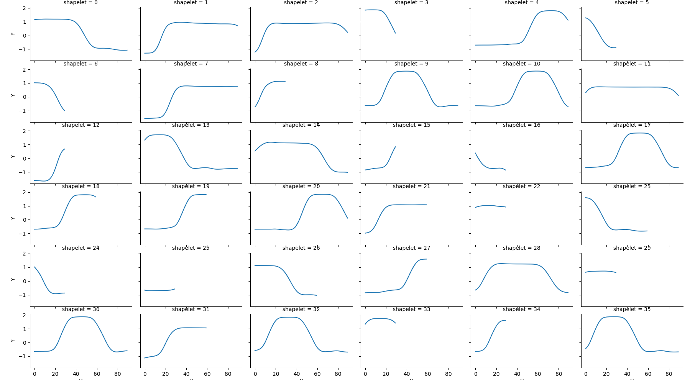

# shaplets
Python implementation of [the Learning Time-Series Shapelets method by Josif Grabocka et al.](http://www.ismll.uni-hildesheim.de/pub/pdfs/grabocka2014e-kdd.pdf), that learns a shapelet-based time-series classifier with gradient descent. 

This implementation view the model as a layered network, where each layer 
implements a forward, a backword and parameters update methods (see below 
diagram). This abstraction makes it easy to think about and implement the 
algorithm.


Note, the loss in this implementation is an updated version of the one in the 
paper to allow training a single network for all the classes in the dataset 
(rather than one network/class). The impact on performance was not estimated. 
For details check shapelets/network/cross_entropy_loss_layer.py

## Installation ##
```bash
git clone git@github.com:mohaseeb/shaplets-python.git
cd shaplets-python
pip install .
# or, for dev
# pip install .[dev]
```
## Usage ##
```python
from shapelets_lts.classification import LtsShapeletClassifier

# create an LtsShapeletClassifier instance
classifier = LtsShapeletClassifier(
    K=20,
    R=3,
    L_min=30,
    epocs=50,
    lamda=0.01,
    eta=0.01,
    shapelet_initialization='segments_centroids',
    plot_loss=True
)

# train the classifier. 
# train_data.shape -> (# train samples X time-series length) 
# train_label.shape -> (# train samples)
classifier.fit(train_data, train_label, plot_loss=True)

# evaluate on test data. 
# test_data.shape -> (# test samples X time-series length)
prediction = classifier.predict(test_data)

# retrieve the learnt shapelets
shapelets = classifier.get_shapelets()


# and plot sample shapelets
from shapelets_lts.util import plot_sample_shapelets
plot_sample_shapelets(shapelets=shapelets, sample_size=36)
```
Also have a look at example.py. For a stable training, make sure all the features in dataset are [standardized](https://en.wikipedia.org/wiki/Feature_scaling#Standardization) (i.e. each has zero mean and unit variance).

Example plot from plot_sample_shapelets.


Although I believe the architecture is good, I think the implementation is way from optimal, and there is plenty of room for improvement.
